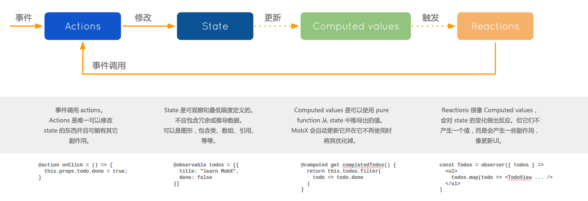

> 此中文文档会与官网文档保持同步

> 欢迎大家共同来完善此文档，为国内 MobX 爱好者提供一个更好的学习环境

> Github 仓库: [https://github.com/SangKa/mobx-docs-cn](https://github.com/SangKa/mobx-docs-cn)


# MobX

_简单、可扩展的状态管理_

[](https://travis-ci.org/mobxjs/mobx)
[](https://coveralls.io/github/mobxjs/mobx?branch=master)
[](https://gitter.im/mobxjs/mobx?utm_source=badge&utm_medium=badge&utm_campaign=pr-badge&utm_content=badge)
[](https://hashnode.com/n/mobx)
[](#backers)
[](#sponsors)
[](https://github.com/prettier/prettier)


* 安装: `npm install mobx --save`。 React 绑定库: `npm install mobx-react --save`。 要启用 ESNext 的装饰器 (可选), 参见下面。
* CDN:
- https://unpkg.com/mobx/lib/mobx.umd.js
- https://cdnjs.com/libraries/mobx

## 入门指南

* <i><a style="color: white; background:green;padding:5px;margin:5px;border-radius:2px" href="https://egghead.io/courses/manage-complex-state-in-react-apps-with-mobx">egghead.io 课程</a></i>
* [十分钟交互式的 MobX + React 教程](https://mobxjs.github.io/mobx/getting-started.html)
* [MobX 3官方文档和API概览](http://cn.mobx.js.org/refguide/api.html) ([MobX 2](https://github.com/mobxjs/mobx/blob/7c9e7c86e0c6ead141bb0539d33143d0e1f576dd/docs/refguide/api.md))
* 视频:
  * [ReactNext 2016: 真实世界的 MobX](https://www.youtube.com/watch?v=Aws40KOx90U) - 40分钟 [幻灯片](https://docs.google.com/presentation/d/1DrI6Hc2xIPTLBkfNH8YczOcPXQTOaCIcDESdyVfG_bE/edit?usp=sharing)
  * [React 和 MobX 实战](https://www.youtube.com/watch?v=XGwuM_u7UeQ). OpenSourceNorth 开发者大会上，Matt Ruby 深入介绍和说明如何使用MobX和React(ES5版本) - 42分钟
  * LearnCode.academy MobX 教程 [第一部分: MobX + React 太棒了 (7分钟)](https://www.youtube.com/watch?v=_q50BXqkAfI) [第二部分: Computed Values and 嵌套/引用的 Observables (12分钟)](https://www.youtube.com/watch?v=nYvNqKrl69s)
  * [录播: MobX 介绍](https://www.youtube.com/watch?v=K8dr8BMU7-8) - 8分钟
  * [访谈: 状态管理很容易 - React Amsterdam 2016 开发者大会](https://www.youtube.com/watch?v=ApmSsu3qnf0&feature=youtu.be) ([幻灯片](https://speakerdeck.com/mweststrate/state-management-is-easy-introduction-to-mobx))
* [样板文件和相关项目](http://mobxjs.github.io/mobx/faq/boilerplates.html)
* 更多教程、博客和视频尽在 [MobX 主页](http://mobxjs.github.io/mobx/faq/blogs.html)
* 更多教程、博客、视频和其他有用的资源尽在 [Awesome MobX](https://github.com/mobxjs/awesome-mobx/blob/master/README-CN.md)

## 入门

MobX 是一个经过战火洗礼的库，它通过透明的函数响应式编程(transparently applying functional reactive programming - TFRP)使得状态管理变得简单和可扩展。MobX背后的哲学很简单:

_任何源自应用状态的东西都应该自动地获得。_

其中包括UI、数据序列化、服务器通讯，等等。



React 和 MobX 是一对强力组合。React 通过提供机制把应用状态转换为可渲染组件树并对其进行渲染。而MobX提供机制来存储和更新应用状态供 React 使用。

对于应用开发中的常见问题，React 和 MobX都提供了最优和独特的解决方案。React 提供了优化UI渲染的机制， 这种机制就是通过使用虚拟DOM来减少昂贵的DOM变化的数量。MobX 提供了优化应用状态与 React 组件同步的机制，这种机制就是使用响应式虚拟依赖状态图表，它只有在真正需要的时候才更新并且永远保持是最新的。

## 核心概念

MobX 的核心概念不多。 下面的代码片段可以在 [JSFiddle](https://jsfiddle.net/mweststrate/f0dptdau/2/) (或者 [不使用 ES6 和 JSX](https://jsfiddle.net/rubyred/55oc981v/))中在线试用。

### Observable state(可观察的状态)

<i><a style="color: white; background:green;padding:5px;margin:5px;border-radius:2px" href="https://egghead.io/lessons/javascript-sync-the-ui-with-the-app-state-using-mobx-observable-and-observer-in-react">egghead.io 第1课: observable & observer</a></i>

MobX 为现有的数据结构(如对象，数组和类实例)添加了可观察的功能。
通过使用 [@observable](http://cn.mobx.js.org/refguide/observable-decorator.html) 装饰器(ES.Next)来给你的类属性添加注解就可以简单地完成这一切。

```javascript
class Todo {
    id = Math.random();
    @observable title = "";
    @observable finished = false;
}
```

使用 `observable` 很像把对象的属性变成excel的单元格。
但和单元格不同的是，这些值不只是原始值，还可以是引用值，比如对象和数组。
你甚至还可以[自定义](http://cn.mobx.js.org/refguide/extending.html)可观察数据源。

### 插曲: 在ES5、ES6和ES.next环境下使用 MobX

这些 `@` 开头的东西对你来说或许还比较陌生，它们是ES.next装饰器。
在 MobX 中使用它们完全是可选的。参见[装饰器文档](http://cn.mobx.js.org/best/decorators.html)详细了解如何使用或者避免它们。
MobX 可以在任何ES5的环境中运行，但是利用像装饰器这样的ES.next的特性是使用 MobX 的最佳选择。
本自述文件的剩余部分都会使用装饰器，但请牢记，_它们是可选的_。

例如，上面一段代码的ES5版本应该是这样:

```javascript
function Todo() {
    this.id = Math.random()
    extendObservable(this, {
        title: "",
        finished: false
    })
}
```

### Computed values(计算值)

<i><a style="color: white; background:green;padding:5px;margin:5px;border-radius:2px" href="https://egghead.io/lessons/javascript-derive-computed-values-and-manage-side-effects-with-mobx-reactions">egghead.io 第3课: 计算值</a></i>

使用 MobX， 你可以定义在相关数据发生变化时自动更新的值。
通过[`@computed`](http://cn.mobx.js.org/refguide/computed-decorator.html) 装饰器或者利用 `(extend)Observable` 时调用 的getter / setter 函数来进行使用。

```javascript
class TodoList {
    @observable todos = [];
    @computed get unfinishedTodoCount() {
        return this.todos.filter(todo => !todo.finished).length;
    }
}
```

当添加了一个新的todo或者某个todo的 `finished` 属性发生变化时，MobX 会确保 `unfinishedTodoCount` 自动更新。
像这样的计算可以类似于 MS Excel 这样电子表格程序中的公式。每当只有在需要它们的时候，它们才会自动更新。

### Reactions(反应)

<i><a style="color: white; background:green;padding:5px;margin:5px;border-radius:2px" href="https://egghead.io/lessons/react-write-custom-mobx-reactions-with-when-and-autorun">egghead.io 第9课: 自定义反应</a></i>

Reactions 和计算值很像，但它不是产生一个新的值，而是会产生一些副作用，比如打印到控制台、网络请求、递增地更新 React 组件树以修补DOM、等等。
简而言之，reactions 在 [响应式编程](https://en.wikipedia.org/wiki/Reactive_programming)和[命令式编程](https://en.wikipedia.org/wiki/Imperative_programming)之间建立沟通的桥梁。

#### React 组件

<i><a style="color: white; background:green;padding:5px;margin:5px;border-radius:2px" href="https://egghead.io/courses/manage-complex-state-in-react-apps-with-mobx">egghead.io 第1课: observable & observer</a></i>

如果你用 React 的话，可以把你的(无状态函数)组件变成响应式组件，方法是在组件上添加 [`observer`](http://cn.mobx.js.org/refguide/observable-decorator.html) 函数/ 装饰器. `observer`由 `mobx-react` 包提供的。

```javascript
import React, {Component} from 'react';
import ReactDOM from 'react-dom';
import {observer} from 'mobx-react';

@observer
class TodoListView extends Component {
    render() {
        return <div>
            <ul>
                {this.props.todoList.todos.map(todo =>
                    <TodoView todo={todo} key={todo.id} />
                )}
            </ul>
            Tasks left: {this.props.todoList.unfinishedTodoCount}
        </div>
    }
}

const TodoView = observer(({todo}) =>
    <li>
        <input
            type="checkbox"
            checked={todo.finished}
            onClick={() => todo.finished = !todo.finished}
        />{todo.title}
    </li>
)

const store = new TodoList();
ReactDOM.render(<TodoListView todoList={store} />, document.getElementById('mount'));
```

`observer` 会将 React (函数)组件转换为它们需要渲染的数据的衍生。
使用 MobX 时没有所谓的智能和无脑组件。
所有的组件都会以巧妙的方式进行渲染，而只需要一种简单无脑的方式来定义它们。MobX 会确保组件总是在需要的时重新渲染，但仅此而已。所以上面例子中的 `onClick` 处理方法会强制对应的 `TodoView` 进行渲染，如果未完成任务的数量(unfinishedTodoCount)已经改变，它将导致 `TodoListView` 进行渲染。
可是，如果移除 `Tasks left` 这行代码(或者将它放到另一个组件中)，当点击 `checkbox` 的时候 `TodoListView` 就不再重新渲染。你可以在 [JSFiddle](https://jsfiddle.net/mweststrate/wv3yopo0/) 中自己动手来验证这点。

#### 自定义 reactions

使用[`autorun`](http://cn.mobx.js.org/refguide/autorun.html)、[`reaction`](http://cn.mobx.js.org/refguide/reaction.html) 和 [`when`](http://cn.mobx.js.org/refguide/when.html) 函数即可简单的创建自定义 reactions，以满足你的具体场景。

例如，每当 `unfinishedTodoCount` 的数量发生变化时，下面的 `autorun` 会打印日志消息:

```javascript
autorun(() => {
    console.log("Tasks left: " + todos.unfinishedTodoCount)
})
```

### MobX 会对什么作出反应?

为什么每次 `unfinishedTodoCount` 变化时都会打印一条新消息？答案就是下面这条经验法则:

_MobX 会对在执行跟踪函数期间读取的任何现有的可观察属性做出反应_。

想深入了解 MobX 是如何知道需要对哪个可观察属性进行反应，请查阅 [理解 MobX 对什么有反应](http://cn.mobx.js.org/best/react.html)。

### Actions(动作)

<i><a style="color: white; background:green;padding:5px;margin:5px;border-radius:2px" href="https://egghead.io/lessons/react-use-mobx-actions-to-change-and-guard-state">egghead.io 第5课: actions</a></i>

不同于 flux 系的一些框架，MobX 对于如何处理用户事件是完全开明的。

* 可以用类似 Flux 的方式完成
* 或者使用 RxJS 来处理事件
* 或者用最直观、最简单的方式来处理事件，正如上面演示所用的 `onClick`

最后全部归纳为: 状态应该以某种方式来更新。

当状态更新后，`MobX` 会以一种高效且无障碍的方式处理好剩下的事情。像下面如此简单的语句，已经足够用来自动更新用户界面了。

从技术上层面来讲，并不需要触发事件、调用分派程序或者类似的工作。归根究底 React 组件只是状态的华丽展示，而状态的衍生由 MobX 来管理。

```javascript
store.todos.push(
    new Todo("Get Coffee"),
    new Todo("Write simpler code")
);
store.todos[0].finished = true;
```

尽管如此，MobX 还是提供了 [`actions`](http://cn.mobx.js.org/refguide/action.html) 这个可选的内置概念。
使用 `actions` 是有优势的: 它们可以帮助你把代码组织的更好，还能在状态何时何地应该被修改这个问题上帮助你做出明智的决定。

## MobX: 简单且可扩展

MobX 是状态管理库中侵入性最小的之一。这使得 `MobX`的方法不但简单，而且可扩展性也非常好:

### 使用类和真正的引用

使用 MobX 不需要使数据标准化。这使得库十分适合那些异常复杂的领域模型(以 Mendix 为例: 一个应用中有大约500个领域类)。

### 保证参照完整性

因为数据不需要标准化，所以 MobX 会自动跟踪状态和衍生之间的关系，你可以免费获得参照完整性。渲染通过三级间接寻址访问的数据？

没有问题，MobX 会跟踪它们，一旦其中一个引用发生了变化，就会重新渲染。作为回报，陈年的老bug已不复存在。作为一个程序员，你可能记不住修改的一些数据可能会影响到的某个角落里看起来毫不相关的组件，但 MobX 不会。

### 更简单的 actions 更便于维护

正如上面所演示的，使用 MobX 修改状态是非常简单的。你只需简单的写出你的目的。MobX 会替你处理好剩下的事情。

### 细粒度的可观测性是高效的

MobX 构建应用中所有衍生的图形，以找到保持最新状态所需的重新计算的最少次数。“衍生一切”或许听上去开销很昂贵，但 MobX 构建虚拟衍生图以保持衍生与状态同步所需的重计算的数量最小化。

事实上，在 Mendix 测试 MobX 时我们发现使用这个库跟踪代码中的关系通常会更有效，然后通过使用手写事件或基于容器组件的“智能”选择器来推送更改。

原因来说，是因为 MobX 会在数据上建立更细粒度的“监听器”，然后你可以通过程序来控制。

其次, MobX 看到衍生之间的因果关系，因此它可以为衍生排序，使得衍生不会运行多次或引入缺陷。

想了解这是如何工作的？ 请参见 [深入剖析 MobX](https://medium.com/@mweststrate/becoming-fully-reactive-an-in-depth-explanation-of-mobservable-55995262a254)。

### 易操作性

MobX 使用原生 javascript 。由于它的侵入性不强，它可以和绝大部分 javascript 库共同使用，而不需要特定的 MobX 风格库。

所以你可以继续使用你的路由，数据获取和工具库，比如`react-router`、 `director`、 `superagent`、 `lodash`，等等。

出于同样的原因，你可以在服务器端和客户端使用它，也可以在 react-native 这样的同构应用中使用。

结论就是: 相比其它状态管理解决方案，当使用 MobX 时通常只需学习更少的新概念。

---

<center>


<strong>可以自豪的说，MobX 已经在 <a href="https://www.mendix.com">Mendix</a> 的任务关键系统中使用 </strong>
</center>

## 赞誉

MobX 的灵感来自excel表格中的反应式编程原理。同样也受到像 MeteorJS、knockout和Vue.js这样的 MVVM 框架的启发。但是 MobX 把透明的函数响应式编程(Transparent Functional Reactive Programming)提升到了一个更好的水平并且提供了独立的实现。它以一种无障碍、同步、可预见和高效的方式实现了 TFRP。

更多的赞誉给[Mendix](https://github.com/mendix) ，它为维护 MobX 给予了灵活性和支持，并提供机会在真实、复杂、性能关键的应用程序中证明 MobX 的哲学。

最终的赞誉属于所有的选择相信、不断尝试、不断验证、乃至[赞助](https://github.com/mobxjs/mobx/blob/master/sponsors.md) MobX 的人们。

## 更多资源及文档

* [MobX 主页](http://mobxjs.github.io/mobx/faq/blogs.html)
* [API概览](http://mobxjs.github.io/mobx/refguide/api.html)
* [教程、博客和视频](http://mobxjs.github.io/mobx/faq/blogs.html)
* [样板文件](http://mobxjs.github.io/mobx/faq/boilerplates.html)
* [相关项目](http://mobxjs.github.io/mobx/faq/related.html)

## 其它人都在说些什么...

> Guise, #mobx isn't pubsub, or your grandpa's observer pattern. Nay, it is a carefully orchestrated observable dimensional portal fueled by the power cosmic. It doesn't do change detection, it's actually a level 20 psionic with soul knife, slashing your viewmodel into submission. (译者注: 这个赞美之词完全没能领会，谁能看懂可以帮忙翻译下 ^.^)

> 在一个独立的项目使用 mobx 几周后，感觉把它引入到团队中真是太棒了。工作时间减半，快乐加倍。

> 使用 mobx 工作对于来我来说，基本就是不断地证明“这种方式太简单，肯定没有办法正常工作”的想法是错误的过程。

> 尝试使用 ES6 版本的 react-mobx 后，你会给它一个热情的拥抱并深深地爱上它。

> 我已经在大型应用中使用了 MobX，和之前使用的 Redux 相比，它更容易阅读和推导。

> mobx 正是我一直想要的方式！它真的超级简单、超级快！棒极了！千万不要错过！

## 贡献

* 小的 pull requests 可以随意发起。但是新功能或者重大变更请先在 Github Issues 中讨论。
* 使用 `npm test` 运行基本测试套件，`npm run coverage` 用来测试套件的覆盖率，`npm run perf` 用来测试性能。

> 注意: 测试前, 请确保运行 `npm run small-build`。

## Flow 支持

MobX 自带 flow typings 。要在项目中使用，在 `.flowconfig` 文件中的 `[libs]` 处添加下面的代码:

```
[libs]
node_modules/mobx/lib/mobx.js.flow
```

## Bower 支持

可以通过臭名昭着的 unpkg.com 获得 Bower 支持:

`bower install https://unpkg.com/mobx/bower.zip`

然后使用文件 `lib/mobx.umd.js` 或者 `lib/mobx.umd.min.js`

## MobX 以前叫做 Mobservable

想了解 `mobservable` 更名为 `mobx` 的所有细节，请参见[变更日志](https://github.com/mobxjs/mobx/blob/master/CHANGELOG.md#200)。

## 捐赠

MobX 是使您的项目成功的关键吗？ 使用[捐赠按钮](https://mobxjs.github.io/mobx/donate.html)分享胜利！ MobX 主要利用空闲时间进行开发，所以任何支助都将不胜感激 :-)。 如果你留下一个名字，它将被添加到[赞助商](https://github.com/mobxjs/mobx/blob/master/sponsors.md)列表 :)。

### 资助者

按月资助支持我们，帮助我们继续进行活动。[[成为资助者](https://opencollective.com/mobx#backer)]

<a href="https://opencollective.com/mobx/backer/2/website" target="_blank"></a>
<a href="https://opencollective.com/mobx/backer/3/website" target="_blank"></a>
<a href="https://opencollective.com/mobx/backer/4/website" target="_blank"></a>
<a href="https://opencollective.com/mobx/backer/5/website" target="_blank"></a>
<a href="https://opencollective.com/mobx/backer/6/website" target="_blank"></a>
<a href="https://opencollective.com/mobx/backer/7/website" target="_blank"></a>
<a href="https://opencollective.com/mobx/backer/8/website" target="_blank"></a>
<a href="https://opencollective.com/mobx/backer/9/website" target="_blank"></a>
<a href="https://opencollective.com/mobx/backer/10/website" target="_blank"></a>
<a href="https://opencollective.com/mobx/backer/11/website" target="_blank"></a>
<a href="https://opencollective.com/mobx/backer/12/website" target="_blank"></a>
<a href="https://opencollective.com/mobx/backer/13/website" target="_blank"></a>
<a href="https://opencollective.com/mobx/backer/14/website" target="_blank"></a>
<a href="https://opencollective.com/mobx/backer/15/website" target="_blank"></a>
<a href="https://opencollective.com/mobx/backer/16/website" target="_blank"></a>
<a href="https://opencollective.com/mobx/backer/17/website" target="_blank"></a>
<a href="https://opencollective.com/mobx/backer/18/website" target="_blank"></a>
<a href="https://opencollective.com/mobx/backer/19/website" target="_blank"></a>
<a href="https://opencollective.com/mobx/backer/20/website" target="_blank"></a>
<a href="https://opencollective.com/mobx/backer/21/website" target="_blank"></a>
<a href="https://opencollective.com/mobx/backer/22/website" target="_blank"></a>
<a href="https://opencollective.com/mobx/backer/23/website" target="_blank"></a>
<a href="https://opencollective.com/mobx/backer/24/website" target="_blank"></a>
<a href="https://opencollective.com/mobx/backer/25/website" target="_blank"></a>
<a href="https://opencollective.com/mobx/backer/26/website" target="_blank"></a>
<a href="https://opencollective.com/mobx/backer/27/website" target="_blank"></a>
<a href="https://opencollective.com/mobx/backer/28/website" target="_blank"></a>
<a href="https://opencollective.com/mobx/backer/29/website" target="_blank"></a>

### 赞助商

成为赞助商后，我们会在 Github 的自述文件中展示您的 LOGO ，并链接到您的网站 [[成为赞助商](https://opencollective.com/mobx#sponsor)]

<a href="https://opencollective.com/mobx/sponsor/0/website" target="_blank"></a>
<a href="https://opencollective.com/mobx/sponsor/1/website" target="_blank"></a>
<a href="https://opencollective.com/mobx/sponsor/2/website" target="_blank"></a>
<a href="https://opencollective.com/mobx/sponsor/3/website" target="_blank"></a>
<a href="https://opencollective.com/mobx/sponsor/4/website" target="_blank"></a>
<a href="https://opencollective.com/mobx/sponsor/5/website" target="_blank"></a>
<a href="https://opencollective.com/mobx/sponsor/6/website" target="_blank"></a>
<a href="https://opencollective.com/mobx/sponsor/7/website" target="_blank"></a>
<a href="https://opencollective.com/mobx/sponsor/8/website" target="_blank"></a>
<a href="https://opencollective.com/mobx/sponsor/9/website" target="_blank"></a>
<a href="https://opencollective.com/mobx/sponsor/10/website" target="_blank"></a>
<a href="https://opencollective.com/mobx/sponsor/11/website" target="_blank"></a>
<a href="https://opencollective.com/mobx/sponsor/12/website" target="_blank"></a>
<a href="https://opencollective.com/mobx/sponsor/13/website" target="_blank"></a>
<a href="https://opencollective.com/mobx/sponsor/14/website" target="_blank"></a>
<a href="https://opencollective.com/mobx/sponsor/15/website" target="_blank"></a>
<a href="https://opencollective.com/mobx/sponsor/16/website" target="_blank"></a>
<a href="https://opencollective.com/mobx/sponsor/17/website" target="_blank"></a>
<a href="https://opencollective.com/mobx/sponsor/18/website" target="_blank"></a>
<a href="https://opencollective.com/mobx/sponsor/19/website" target="_blank"></a>
<a href="https://opencollective.com/mobx/sponsor/20/website" target="_blank"></a>
<a href="https://opencollective.com/mobx/sponsor/21/website" target="_blank"></a>
<a href="https://opencollective.com/mobx/sponsor/22/website" target="_blank"></a>
<a href="https://opencollective.com/mobx/sponsor/23/website" target="_blank"></a>
<a href="https://opencollective.com/mobx/sponsor/24/website" target="_blank"></a>
<a href="https://opencollective.com/mobx/sponsor/25/website" target="_blank"></a>
<a href="https://opencollective.com/mobx/sponsor/26/website" target="_blank"></a>
<a href="https://opencollective.com/mobx/sponsor/27/website" target="_blank"></a>
<a href="https://opencollective.com/mobx/sponsor/28/website" target="_blank"></a>
<a href="https://opencollective.com/mobx/sponsor/29/website" target="_blank"></a>
