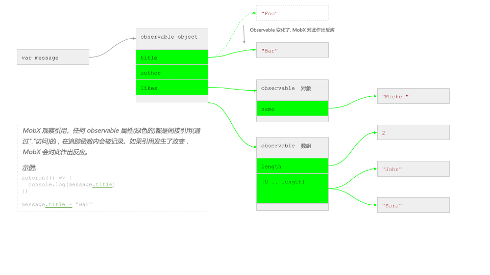

# MobX 会对什么作出反应?

MobX 通常会对你期望的东西做出反应。
这意味着在90％的场景下，mobx “都可以工作”。
然而，在某些时候，你会遇到一个情况，它可能不会像你所所期望的那样工作。
在这个时候理解 MobX 如何确定对什么有反应就显得尤为重要。

> MobX 会对在执行跟踪函数期间读取的任何**现有的可观察属性**做出反应。

* **“读取”** 是对象属性的间接引用，可以用过 `.` (例如 `user.name`) 或者 `[]` (例如 `user['name']`) 的形式完成。
* **“可追踪函数”** 是 `computed` 表达式、observer 组件的 `render()` 方法和 `when`、`reaction` 和 `autorun` 的第一个入参函数。
* **“其间(during)”** 意味着只追踪那些在函数执行时被读取的 observable 。这些值是否由追踪函数直接或间接使用并不重要。

换句话说，MobX 不会对其作出反应:
 * 从 observable 获取的值，但是在追踪函数之外
 * 在异步调用的代码块中读取的 observable

## MobX 追踪属性访问，而不是值

用一个示例来阐述上述规则，假设你有如下的 observable 数据结构(默认情况下 `observable` 会递归应用，所以本示例中的所有字段都是可观察的)。

```javascript
let message = observable({
    title: "Foo",
    author: {
        name: "Michel"
    },
    likes: [
        "John", "Sara"
    ]
})
```

在内存中看起来像下面这样。 绿色框表示**可观察**属性。 请注意，**值** 本身是不可观察的！



现在 MobX 基本上所做的是记录你在函数中使用的是哪个**箭头**。之后，只要这些箭头中的其中一个改变了(它们开始引用别的东西了)，它就会重新运行。

## 示例

来看下下面这些示例(基于上面定义的 `message` 变量):

#### 正确的: 在追踪函数内进行间接引用

```javascript
autorun(() => {
    console.log(message.title)
})
message.title = "Bar"
```

这将如预期一样会作出反应，`title` 属性会被 autorun 间接引用并且在之后发生了改变，所以这个改变是能检测到的。

你可以通过在追踪函数内调用 `whyRun()` 方法来验证 MobX 在追踪什么。以上面的函数为例，输出结果如下:

```javascript
autorun(() => {
    console.log(message.title)
    whyRun()
})

// 输出:
WhyRun? reaction 'Autorun@1':
 * Status: [running]
 * This reaction will re-run if any of the following observables changes:
    ObservableObject@1.title
```

#### 错误的: 改变了非 observable 的引用

```javascript
autorun(() => {
    console.log(message.title)
})
message = observable({ title: "Bar" })
```

这将**不会**作出反应。`message` 被改变了，但它不是 observable，它只是一个**引用** observable 的变量，但是变量(引用)本身并不是可观察的。


#### 错误的: 在追踪函数外进行间接引用

```javascript
var title = message.title;
autorun(() => {
    console.log(title)
})
message.title = "Bar"
```

这将**不会**作出反应。`message.title` 是在 `autorun` 外面进行的间接引用，在间接引用的时候 `title` 变量只是包含 `message.title` 的值(字符串 `Foo`)而已。
`title` 变量不是 observable，所以 `autorun` 永远不会作出反应。

#### 正确的: 在追踪函数内进行间接引用

```javascript
autorun(() => {
    console.log(message.author.name)
})
message.author.name = "Sara";
message.author = { name: "John" };
```

对于这两个变化都将作出反应。 `author` 和 `author.name` 都是通过 `.` 访问的，使得 MobX 可以追踪这些引用。

#### 错误的: 存储 observable 对象的本地引用而不对其追踪

```javascript
const author = message.author;
autorun(() => {
    console.log(author.name)
})
message.author.name = "Sara";
message.author = { name: "John" };
```

对于第一个改变将会作出反应，`message.author` 和 `author` 是同一个对象，而 `name` 属性在 autorun 中进行的间接引用。
但对于第二个改变将**不会**作出反应，`message.author` 的关系没有通过 `autorun` 追踪。Autorun 仍然使用的是“老的” `author`。

#### 正确的: 在追踪函数内访问数组属性


```javascript
autorun(() => {
    console.log(message.likes.length);
})
message.likes.push("Jennifer");
```

这将如预期一样会作出反应。`.length` 指向一个属性。
注意这会对数组中的**任何**更改做出反应。
数组不追踪每个索引/属性(如 observable 对象和映射)，而是将其作为一个整体追踪。

#### 错误的: 在追踪函数内索引越界访问

```javascript
autorun(() => {
    console.log(message.likes[0]);
})
message.likes.push("Jennifer");
```

使用上面的示例数据是会作出反应的，数组的索引计数作为属性访问，但前提条件**必须**是提供的索引小于数组长度。
MobX 不会追踪还不存在的索引或者对象属性(当使用 observable 映射(map)时除外)。
所以建议总是使用 `.length` 来检查保护基于数组索引的访问。

#### 正确的: 在追踪函数内访问数组方法

```javascript
autorun(() => {
    console.log(message.likes.join(", "));
})
message.likes.push("Jennifer");
```

这将如预期一样会作出反应。所有不会改变数组的数组方法都会自动地追踪。

---

```javascript
autorun(() => {
    console.log(message.likes.join(", "));
})
message.likes[2] = "Jennifer";
```

这将如预期一样会作出反应。所有数组的索引分配都可以检测到，但前提条件**必须**是提供的索引小于数组长度。

#### 错误的: “使用” observable 但没有访问它的任何属性

```javascript
autorun(() => {
    message.likes;
})
message.likes.push("Jennifer");
```

这将**不会**作出反应。只是因为 `likes` 数组本身并没有被 `autorun` 使用，只是引用了数组。
所以相比之下，`messages.likes = ["Jennifer"]` 是会作出反应的，表达式没有修改数组，而是修改了 `likes` 属性本身。

#### 错误的: 使用对象的非 observable 属性


```javascript
autorun(() => {
    console.log(message.postDate)
})
message.postDate = new Date()
```

这将**不会**作出反应。MobX 只能追踪 observable 属性。

#### 错误的: 使用 observable 对象还不存在的属性

```javascript
autorun(() => {
    console.log(message.postDate)
})
extendObservable(message, {
    postDate: new Date()
})
```

这将**不会**作出反应。MobX 不会对当追踪开始时还不能存在的 observable 属性作出反应。
如果两个表达式交换下顺序，或者任何其它的 observable 引起 `autorun` 再次运行的话，`autorun` 也会开始追踪 `postDate` 属性了。

#### 正确的: 使用映射中还不存在的项

```javascript
const twitterUrls = observable(asMap({
    "John": "twitter.com/johnny"
}))

autorun(() => {
    console.log(twitterUrls.get("Sara"))
})
twitterUrls.set("Sara", "twitter.com/horsejs")
```

这将**会**作出反应。Observable 映射支持观察还不存在的项。
注意这里最初会输出 `undefined`。
可以通过使用 `twitterUrls.has("Sara")` 来先检查该项是否存在。
所以对于动态键集合，总是使用 observable 映射。


## MobX 只追踪同步地访问数据

```javascript
function upperCaseAuthorName(author) {
    const baseName = author.name;
    return baseName.toUpperCase();
}
autorun(() => {
    console.log(upperCaseAuthorName(message.author))
})
message.author.name = "Chesterton"
```
这将**会**作出反应。尽管 `author.name` 不是在 `autorun` 本身的代码块中进行间接引用的。
MobX 会追踪发生在 `upperCaseAuthorName` 函数里的间接引用，因为它是在 autorun 执行期间发生的。

----

```javascript
autorun(() => {
    setTimeout(
        () => console.log(message.likes.join(", ")),
        10
    )
})
message.likes.push("Jennifer");
```
这将**不会**作出反应。在 `autorun` 执行期间没有访问到任何 observable，而只在 `setTimeout` 执行期间访问了。
通常来说，这是相当明显的，很少会导致问题。
这里需要注意的是将可渲染的回调传递给 React 组件，例如下面的示例:

```javascript
const MyComponent = observer(({ message }) =>
    <SomeContainer
        title = {() => <div>{message.title}</div>}
    />
)

message.title = "Bar"
```

起初看上去一切似乎都是没问题的，除了 `<div>` 实际上不是由 `MyComponent`(有追踪的渲染) 渲染的，而是 `SomeContainer`。
所以要确保 `SomeContainer` 的 title 可以正确对新的 `message.title` 作出反应，`SomeContainer` 应该也是一个 `observer`。
如果 `SomeContainer` 来自外部库，你也可以通过在自己的无状态 `observer` 组件中包装 `div` 来解决这个问题，并在回调中实例化:

```javascript
const MyComponent = observer(({ message }) =>
    <SomeContainer
        title = {() => <TitleRenderer message={message} />}
    />
)

const TitleRenderer = observer(({ message }) =>
    <div>{message.title}</div>}
)

message.title = "Bar"
```

## 避免在本地字段中缓存 observable

一个常见的错误就是把间接引用的 observable 存储到本地变量，然后认为组件会作出反应。举例来说:

```javascript
@observer class MyComponent extends React.component {
    author;
    constructor(props) {
        super(props)
        this.author = props.message.author;
    }

    render() {
        return <div>{this.author.name}</div>
    }
}
```

组件会对 `author.name` 的变化作出反应，但不会对 `message` 本身的 `.author` 的变化作出反应！因为这个间接引用发生在 `render()` 之外，而`render()` 是 `observer` 组件的唯一追踪函数。
注意，即便把组件的 `author` 字段标记为 `@observable` 字段也不能解决这个问题，`author` 仍然是只分配一次。
这个问题可以简单地解决，方法是在 `render()` 中进行间接引用或者在组件实例上引入一个计算属性:

```javascript
@observer class MyComponent extends React.component {
    @computed get author() {
        return this.props.message.author
    }
// ...
```

## 多个组件将如何渲染

假设下面的组件是用来渲染上面的 `message` 对象的。

```javascript
const Message = observer(({ message }) =>
    <div>
        {message.title}
        <Author author={ message.author } />
        <Likes likes={ message.likes } />
    </div>
)

const Author = observer(({ author }) =>
    <span>{author.name}</span>
)

const Likes = observer(({ likes }) =>
    <ul>
        {likes.map(like =>
            <li>{like}</li>
        )}
    </ul>
)
```

| 变化 | 重新渲染组件 |
| --- | --- |
| `message.title = "Bar"` | `Message` |
| `message.author.name = "Susan"` | `Author` (`.author` 在 `Message` 中进行间接引用, 但没有改变)* |
| `message.author = { name: "Susan"}` | `Message`, `Author` |
| `message.likes[0] = "Michel"` | `Likes` |

注意:
1. \* 如果 `Author` 组件是像这样调用的: `<Author author={ message.author.name} />` 。`Message` 会是进行间接引用的组件并对 `message.author.name` 的改变作出反应。尽管如此，`<Author>` 同样会重新渲染，因为它接收到了一个新的值。所以从性能上考虑，越晚进行间接引用越好。
2. \** 如果 likes 数组里面的是对象而不是字符串，并且它们在它们自己的 `Like` 组件中渲染，那么对于发生在某个具体的 like 中发生的变化，`Likes` 组件将不会重新渲染。

## TL;DR

> MobX 会对在执行跟踪函数期间读取的任何**现有的可观察属性**做出反应。
